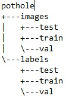

# Pothole-detection-using-Neural-Networks-CNN-
Preprocessing of dataset for detection model.
 Dataset can be dound here.
 https://drive.google.com/drive/folders/1vUmCvdW3-2lMrhsMbXdMWeLcEz__Ocuy?usp=sharing
 After Preprocessing one needs to manually select train/test and validation images and move to respective folders in below subtree
 

 This folder to be placed in downloaded repository from the link https://github.com/ultralytics/yolov5.git
